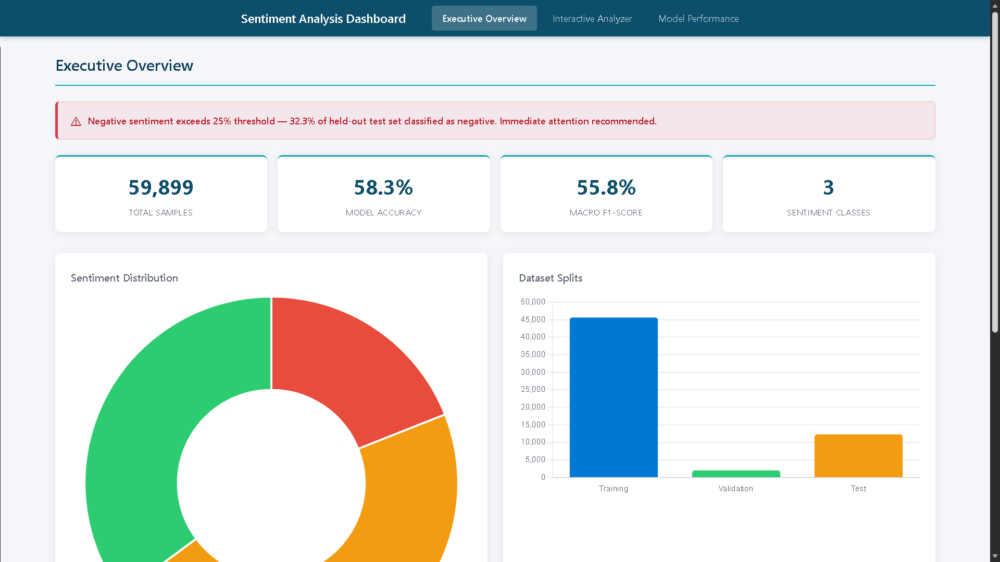

<div align="center">

### **Social Media Sentiment Analysis Dashboard**

**AI-Powered Tweet Sentiment Classification with Interactive Dashboard & In-Browser Inference**

[](LICENSE)
[]()
[]()
[]()
[]()
[]()
[]()
[]()
[]()
[]()

---

**Social Media Sentiment Analysis Dashboard** is a portfolio-grade ML platform that classifies tweets into positive, neutral, or negative sentiment using supervised learning on the TweetEval Sentiment Benchmark dataset (59,899 tweets).
It achieves **58.3% accuracy** and **55.8% Macro F1** on the held-out test set (19/19 tests passing) while operating as a **serverless GitHub Pages deployment** with **zero-cost static hosting** and **100% in-browser inference**.

[**Live Dashboard**](https://girishshenoy16.github.io/Social-Media-Sentiment-Analysis-Dashboard/) | [**Project Report**](reports/PROJECT_REPORT.md)

</div>

---

## Live Demo

<div align="center">

[

ML-powered tweet sentiment classification with a **Power BI-inspired** 3-section dashboard. 100% static deployment on GitHub Pages. Zero data leaves the browser.

</div>

---

## 1. Business Problem

Organizations monitoring social media need to automatically classify public sentiment toward brands, products, and campaigns. Manual analysis of millions of daily social media posts is infeasible, creating demand for automated sentiment analysis at scale.

This system classifies tweets into three sentiment categories, enabling real-time brand monitoring, customer feedback analysis, and campaign performance tracking.

## 2. Dataset

**TweetEval Sentiment Benchmark** — 59,899 tweets split into train/validation/test sets.

| Split      | Samples    | Percentage |
|------------|------------|------------|
| Training   | 45,615     | 76.2%      |
| Validation | 2,000      | 3.3%       |
| Test       | 12,284     | 20.5%      |
| **Total**  | **59,899** | **100%**   |

**Class Distribution (combined dataset):**

| Class    | Count  | Percentage |
|----------|--------|------------|
| Negative | 11,377 | 19.0%      |
| Neutral  | 27,479 | 45.9%      |
| Positive | 21,043 | 35.1%      |

Classes: `negative` (0), `neutral` (1), `positive` (2)

## 3. Model Results

| Model                   | Accuracy  | Macro Precision | Macro Recall | Macro F1  |
|-------------------------|-----------|-----------------|--------------|-----------|
| **Logistic Regression** | **58.3%** | **58.0%**       | **56.4%**    | **55.8%** |
| Linear SVM              | 57.2%     | 56.2%           | 55.9%        | 55.3%     |

**Winner:** Logistic Regression — highest accuracy and F1, full JS-reproducibility, interpretable coefficients.

### Test-Set Confusion Matrix (Logistic Regression)

|                     | Predicted Negative | Predicted Neutral | Predicted Positive |
|---------------------|--------------------|-------------------|--------------------|
| **Actual Negative** | 1,510              | 2,042             | 420                |
| **Actual Neutral**  | 761                | 4,219             | 957                |
| **Actual Positive** | 103                | 842               | 1,430              |

## 4. Dashboard

| Section                  | Features                                                                                                                                  |
|--------------------------|-------------------------------------------------------------------------------------------------------------------------------------------|
| **Executive Overview**   | 4 KPI cards, data-driven sentiment donut, dataset split bar chart, top positive/negative terms, negative sentiment alert (>25% threshold) |
| **Interactive Analyzer** | Real-time in-browser prediction, confidence %, probability breakdown, automated 25-case parity test runner, lexicon demo classifier       |
| **Model Performance**    | LR vs SVM metrics table, class-wise performance chart, confusion matrices, data-derived business insights                                 |

### Data Integrity

All dashboard visualizations are driven by Python-generated data — no hardcoded values:

- Sentiment donut reads class counts from `dashboard_data.json`
- Negative alert reads actual test-set class distribution (32.3% of test set)
- Confusion matrices generated directly to `docs/outputs/` by pipeline

## 5. Architecture

```
data/raw/TweetEval Sentiment Dataset
    ↓
Data Validation (src/data_loader.py)
    ↓
Deterministic Preprocessing (src/preprocessor.py)
    ↓
TF-IDF Vectorization — fitted ONLY on training data (src/vectorizer.py)
    ↓
Model Training: Logistic Regression vs Linear SVM (src/train.py)
    ↓
Evaluation & Confusion Matrices → docs/outputs/ (src/evaluate.py)
    ↓
Artifact Export → docs/data/web_model.json + dashboard_data.json (src/exporter.py)
    ↓
Python ↔ JS Parity Verification (25 sentences, 100% agreement, 0.000000 max diff)
    ↓
Shared Prediction Core — browser + Node.js compatible (docs/js/predictor-core.js)
    ↓
Power BI-Inspired 3-Section Dashboard (docs/)
    ↓
Static GitHub Pages Deployment
```

### Key Design Decisions

- **Static deployment** via GitHub Pages (zero server required)
- **In-browser inference** — no API calls, no backend, full privacy
- **Deterministic preprocessing** — identical 5-step pipeline in Python and JavaScript
- **No data leakage** — TF-IDF fitted only on training data
- **Single canonical test set** — 25 sentences shared across all validators
- **Shared prediction core** — one implementation used by browser, Node.js CLI, and pytest

## 6. Python ↔ JavaScript Parity

| Check                                               | Result                                         |
|-----------------------------------------------------|------------------------------------------------|
| Canonical test sentences                            | 25 (defined in `tests/parity_test_cases.json`) |
| Class-label agreement                               | 100% (25/25)                                   |
| Max probability difference                          | 0.000000                                       |
| `softmax(decision_function())` vs `predict_proba()` | Identical (diff = 0.00e+00)                    |
| JS writes reference files                           | No — Python is sole reference generator        |
| Prediction implementations                          | 1 shared core (`predictor-core.js`)            |

## 7. Testing & Quality

| Module              | Tests  | Status        |
|---------------------|--------|---------------|
| test_data_loader.py | 6      | ✅            |
| test_pipeline.py    | 12     | ✅            |
| test_parity.py      | 1      | ✅            |
| **Total**           | **19** | **100% pass** |

- 25/25 Python ↔ JavaScript parity tests pass (100% class agreement)
- Probability difference: 0.000000 across all test cases
- Zero data leakage verified by automated test
- Deterministic training verified (identical results with `random_state=42`)

## 8. Quick Start

```bash
# Clone the repository
git clone https://github.com/girishshenoy16/Social-Media-Sentiment-Analysis-Dashboard.git
cd Social-Media-Sentiment-Analysis-Dashboard

# Create and activate virtual environment
python -m venv venv
venv\Scripts\activate          # Windows
source venv/bin/activate       # Linux/Mac

# Install dependencies
pip install --upgrade pip
pip install -r requirements.txt

# Run complete pipeline (trains models, exports artifacts, generates confusion matrices)
python main.py

# Run tests
python -m pytest tests/ -v

# Node.js parity test
node docs/js/test-runner.js

# Start dashboard server
python -m http.server 8000 --directory docs

# Open http://localhost:8000
```

## Folder Structure

```
Social Media Sentiment Analysis Dashboard/
├── data/
│   ├── raw/                              # Immutable TweetEval Benchmark Dataset
│   └── processed/                        # Processed cleaned datasets
├── src/
│   ├── data_loader.py                    # Data integrity validator & parser
│   ├── preprocessor.py                   # Deterministic text cleaning engine
│   ├── vectorizer.py                     # TF-IDF feature extraction pipeline
│   ├── train.py                          # Model training (LR & Linear SVM)
│   ├── evaluate.py                       # Test set evaluation & confusion matrices
│   └── exporter.py                       # Web artifact exporter
├── models/                               # Serialized model artifacts (.pkl)
├── outputs/                               # Confusion matrices & metrics JSON
├── tests/
│   ├── test_data_loader.py
│   ├── test_pipeline.py
│   ├── test_parity.py                    # Python ↔ JS parity test
│   └── parity_test_cases.json            # Canonical 25 test sentences
├── docs/
│   ├── index.html                        # Single-page dashboard
│   ├── style.css
│   ├── model_export.json
│   └── app.js
├── reports/
│   ├── PROJECT_REPORT.md
│   └── EXECUTIVE_SUMMARY.md
├── main.py                               # Pipeline CLI entrypoint
├── requirements.txt
└── README.md
```

## 9. Tech Stack

| Layer      | Technologies                                           |
|------------|--------------------------------------------------------|
| ML         | scikit-learn (Logistic Regression, Linear SVM), TF-IDF |
| Frontend   | HTML5, CSS3, Vanilla JS (ES6+), Chart.js 4.4.0         |
| Testing    | pytest (19 tests), Node.js (parity validation)         |
| Deployment | GitHub Pages (100% static)                             |

## 10. Limitations & Future Scope

**Limitations:**
- Accuracy constrained by inherent difficulty of short-text sentiment analysis
- Model trained on English-language tweets only
- Performance affected by class imbalance (neutral dominates at 45.9%)
- Cannot capture sarcasm or context-dependent sentiment

**Future Scope:**
- Transformer-based models (BERT, RoBERTa) for improved accuracy
- Hyperparameter tuning (GridSearchCV/Optuna)
- Multi-language sentiment support
- Real-time Twitter API integration
- SHAP-based explainability layer

---

## Contact

<div align="center">

**Girish Shenoy**

[](https://github.com/girishshenoy16)
[](https://linkedin.com/in/girishshenoys)
[](mailto:girishpshenoy09@gmail.com)

</div>

---

## License

This project is licensed under the MIT License — see the [LICENSE](LICENSE) file for details.

---

## Acknowledgements

| Resource                                                       | Description                               |
|----------------------------------------------------------------|-------------------------------------------|
| [TweetEval Benchmark](https://github.com/cardiffnlp/tweeteval) | Tweet classification evaluation framework |
| [Scikit-learn](https://scikit-learn.org/)                      | Machine learning in Python                |
| [Chart.js](https://www.chartjs.org/)                           | JavaScript charting library               |
| [VADER Sentiment](https://github.com/cjhutto/vaderSentiment)   | Lexicon-based sentiment analysis          |

---

<div align="center">

**Built with precision. Designed for social media analytics. Documented for real-world decision support.**

Social Media Sentiment Analysis Dashboard v1.0 — Portfolio-Grade Sentiment Classification & Decision Support System

</div>
